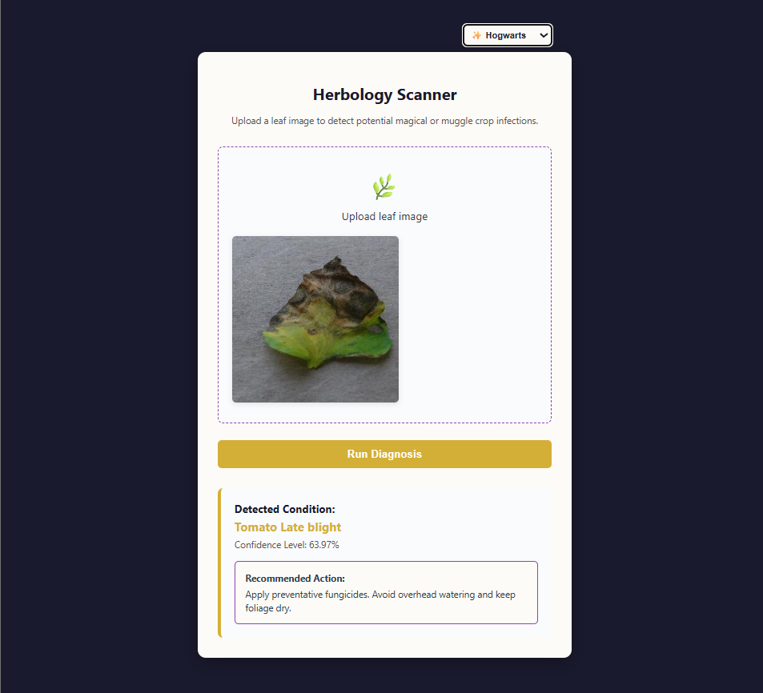
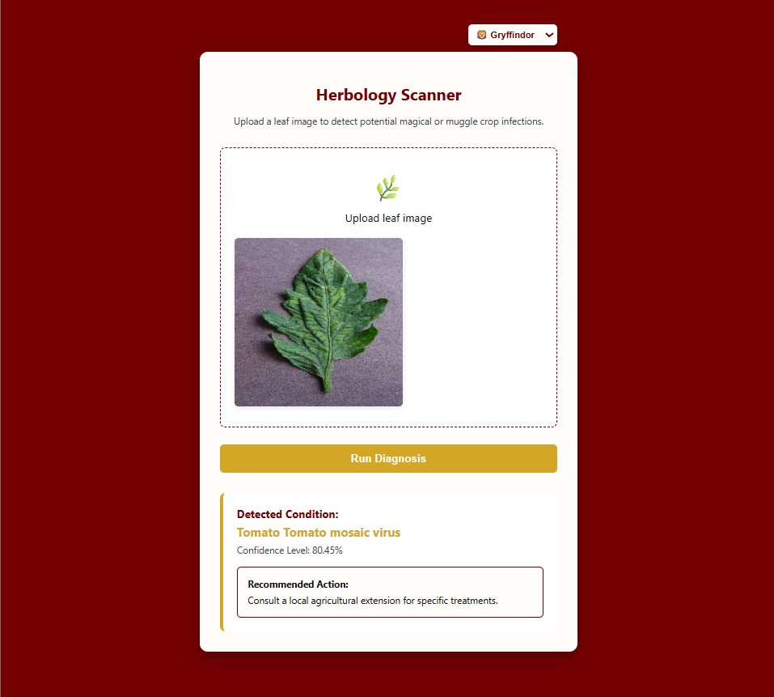
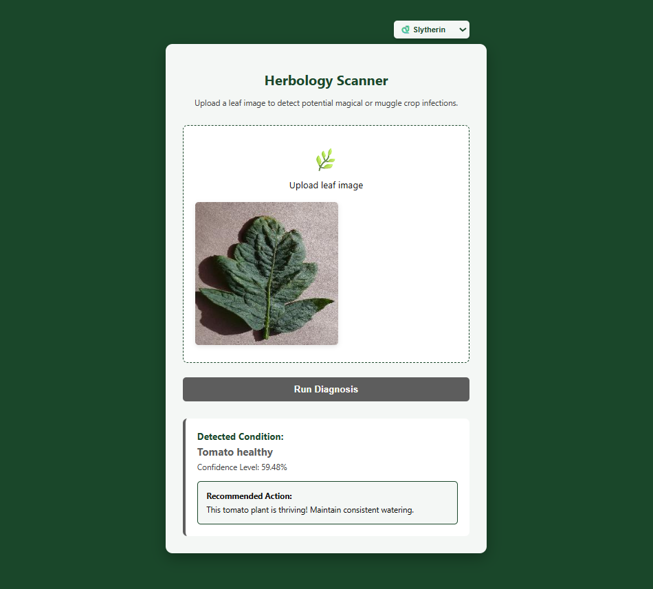
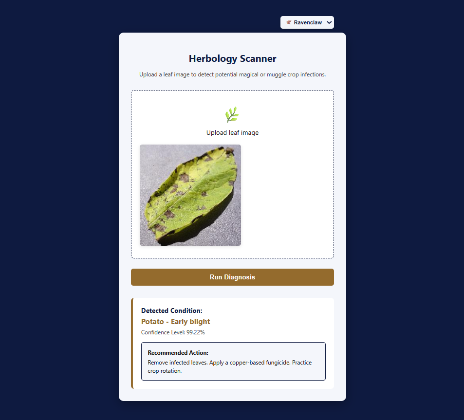
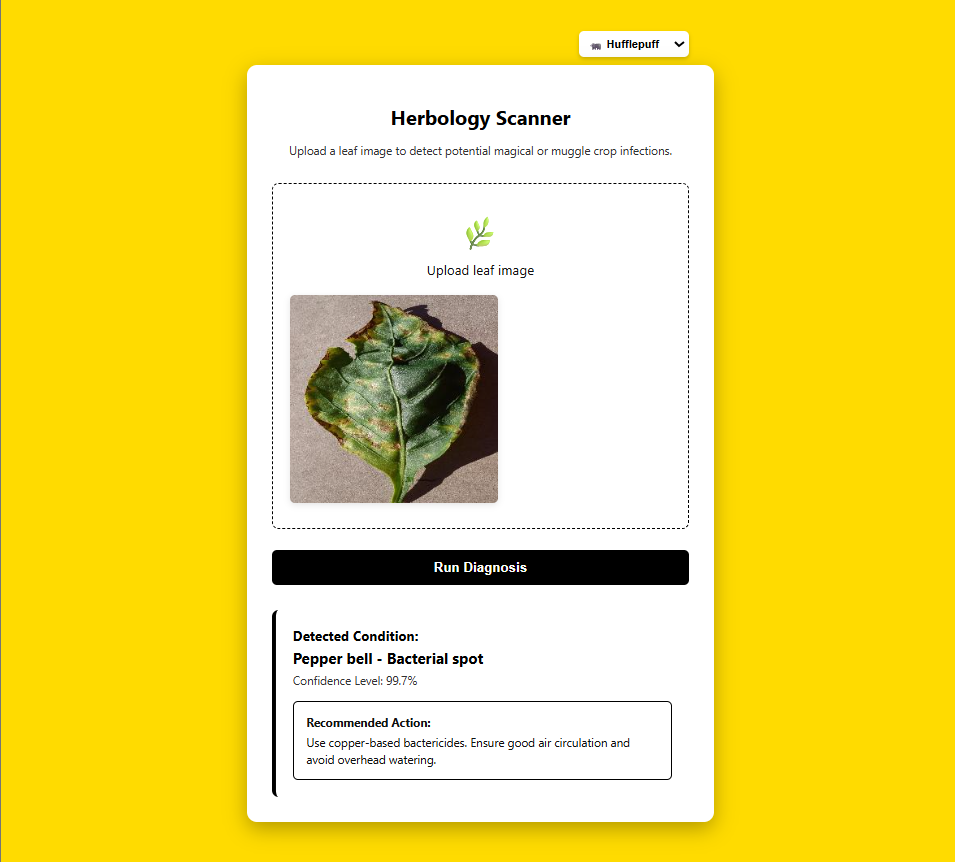

# 🌿 Plant Disease Detection & Diagnosis System

### Deep Learning-Powered Plant Disease Classification and Treatment Recommendation Web Application

> An end-to-end Artificial Intelligence system that identifies plant diseases from leaf images and provides treatment recommendations using a fine-tuned ResNet18 Convolutional Neural Network (CNN), a FastAPI backend, and a responsive web interface.

<p align="center">
  
  
  
  
  
  
  
  
</p>

---

## 📖 Overview

Plant diseases significantly impact agricultural productivity and food security worldwide. Early disease detection enables farmers and agricultural professionals to take preventive measures before diseases spread and cause severe crop losses.

This project demonstrates a complete Computer Vision and Deep Learning pipeline capable of classifying plant diseases from leaf images and providing corresponding treatment recommendations.

The application combines Machine Learning, Backend Development, and Frontend Development into a single deployable solution.

### Key Objectives

* Detect plant diseases from leaf images.
* Provide real-time predictions.
* Offer treatment recommendations.
* Demonstrate Transfer Learning with ResNet18.
* Deploy a trained deep learning model using FastAPI.
* Build an interactive web-based user experience.

---

## 🎯 Project Highlights

### Artificial Intelligence

* Deep Learning-based image classification.
* Transfer Learning using ResNet18.
* Plant disease recognition from leaf images.
* Real-time model inference.

### Backend Development

* REST API built with FastAPI.
* Image upload handling.
* Prediction endpoint implementation.
* Lightweight deployment architecture.

### Frontend Development

* Responsive user interface.
* Dynamic Hogwarts-inspired themes.
* Real-time prediction workflow.
* Interactive user experience.

### Software Engineering

* Modular project structure.
* Git version control.
* Reproducible machine learning workflow.
* Documentation and deployment support.

---

## 📑 Table of Contents

* Overview
* Features
* Machine Learning Pipeline
* System Architecture
* Dataset
* Technology Stack
* Project Structure
* Installation
* Running the Application
* API Documentation
* User Interface
* Screenshots
* Model Information
* Project Status
* Author
* License

---

# ✨ Features

## 🔍 Disease Detection

* Upload plant leaf images.
* Classify healthy and diseased plants.
* Generate predictions in real time.
* Display confidence-based results.

## 🧠 Deep Learning Model

* ResNet18 architecture.
* Transfer Learning approach.
* Optimized for efficient inference.
* Trained using the PlantVillage dataset.

## 💊 Treatment Recommendations

* Disease-specific guidance.
* Suggested management practices.
* Preventive recommendations.

## ⚡ FastAPI Backend

* Lightweight REST API.
* Fast response times.
* Easy deployment.

## 🎨 Interactive User Interface

* Mobile-friendly design.
* Theme customization.
* Hogwarts-inspired visual styles.

---

# 🔄 Machine Learning Pipeline

The project follows a complete machine learning workflow from data exploration to deployment.

```text
PlantVillage Dataset
        │
        ▼
Data Exploration
        │
        ▼
Data Preprocessing
        │
        ▼
Data Augmentation
        │
        ▼
Transfer Learning
(ResNet18)
        │
        ▼
Model Training
        │
        ▼
Model Evaluation
        │
        ▼
Model Export (.pth)
        │
        ▼
FastAPI Deployment
        │
        ▼
Real-Time Prediction
```

---

# 🏗️ System Architecture

```text
User Uploads Leaf Image
            │
            ▼
Frontend Interface
(HTML/CSS/JavaScript)
            │
            ▼
FastAPI Backend
            │
            ▼
Image Preprocessing
            │
            ▼
ResNet18 CNN Model
            │
            ▼
Disease Prediction
            │
            ▼
Treatment Recommendation
            │
            ▼
Results Displayed to User
```

---

# 🌱 Dataset

This project uses the PlantVillage Dataset, a widely used benchmark dataset for plant disease classification.

### Dataset Characteristics

| Property      | Value                      |
| ------------- | -------------------------- |
| Dataset       | PlantVillage               |
| Domain        | Agriculture                |
| Task          | Multi-Class Classification |
| Learning Type | Supervised Learning        |
| Input         | RGB Images                 |
| Framework     | PyTorch                    |

The dataset contains labeled images of healthy and diseased plant leaves used to train and evaluate the model.

---

# 🛠️ Technology Stack

## Machine Learning

* PyTorch
* Torchvision
* NumPy
* Pillow

## Backend

* FastAPI
* Uvicorn

## Frontend

* HTML5
* CSS3
* JavaScript

## Development Tools

* Jupyter Notebook
* VS Code
* Git
* GitHub

---

# 📂 Project Structure

```text
plant-disease-detection
│
├── app
│   ├── main.py
│   ├── plant_disease_model.pth
│   ├── index.html
│   ├── style.css
│   ├── script.js
│   └── favicon.png
│
├── assets
│   ├── theme-hogwarts.png
│   ├── theme-gryffindor.png
│   ├── theme-slytherin.png
│   ├── theme-ravenclaw.png
│   └── theme-hufflepuff.png
│
├── data
│   └── raw
│       └── PlantVillage
│
├── notebooks
│   ├── 00_eda_visualization.ipynb
│   ├── 01_data_preprocessing.ipynb
│   ├── 02_model_training.ipynb
│   └── 03_real_time_detection.ipynb
│
├── LICENSE
├── CONTRIBUTING.md
├── CHANGELOG.md
├── MODEL_CARD.md
├── requirements.txt
└── README.md
```

---

# 📚 Notebook Workflow

### 00_eda_visualization.ipynb

* Dataset exploration
* Class distribution analysis
* Data visualization
* Sample image inspection

### 01_data_preprocessing.ipynb

* Image preprocessing
* Data normalization
* Data augmentation
* Dataset preparation

### 02_model_training.ipynb

* Transfer learning implementation
* ResNet18 fine-tuning
* Model training
* Validation and evaluation

### 03_real_time_detection.ipynb

* Model loading
* Prediction testing
* Inference validation

---

# 🚀 Installation

## Clone the Repository

```bash
git clone https://github.com/umandathathsarani/plant-disease-detection.git

cd plant-disease-detection
```

---

## Create a Virtual Environment

### Windows

```bash
python -m venv venv

venv\Scripts\activate
```

### Linux / macOS

```bash
python -m venv venv

source venv/bin/activate
```

---

## Install Dependencies

```bash
pip install -r requirements.txt
```

---

# ▶️ Running the Application

## Start the FastAPI Server

```bash
cd app

uvicorn main:app --reload
```

The server will run locally at:

```text
http://127.0.0.1:8000
```

---

## Launch the Frontend

Open:

```text
app/index.html
```

in your browser.

---

# 🔌 API Documentation

## POST /predict

Accepts a plant leaf image and returns a prediction result.

### Example Response

```json
{
  "prediction": "Tomato Early Blight",
  "confidence": 98.74,
  "treatment": "Apply a copper-based fungicide and remove infected leaves."
}
```

---

# 🎨 User Interface

The application includes a customizable Hogwarts-inspired theme system.

### 🏰 Hogwarts

Default application theme.

### 🦁 Gryffindor

Inspired by bravery and courage.

### 🐍 Slytherin

Inspired by ambition and leadership.

### 🦅 Ravenclaw

Inspired by wisdom and creativity.

### 🦡 Hufflepuff

Inspired by loyalty and dedication.

---

# 📸 Screenshots

## Hogwarts Theme



## Gryffindor Theme



## Slytherin Theme



## Ravenclaw Theme



## Hufflepuff Theme



---

# 📊 Model Information

| Property            | Value             |
| ------------------- | ----------------- |
| Architecture        | ResNet18          |
| Framework           | PyTorch           |
| Learning Method     | Transfer Learning |
| Dataset             | PlantVillage      |
| Classification Type | Multi-Class       |
| Deployment          | FastAPI           |
| Inference           | Real-Time         |

---

# ✅ Project Status

**Status:** Completed

This project is currently maintained as a portfolio project demonstrating:

* Deep Learning
* Computer Vision
* Transfer Learning
* FastAPI Deployment
* Frontend Integration
* End-to-End AI Application Development

The project is considered feature complete.

---

# 👨‍💻 Author

## Mummullage Binuri Umanda Thathsarani

Bachelor of Science (Hons) in Information Technology

Specialized in Artificial Intelligence

GitHub: https://github.com/umandathathsarani

---

# ⭐ Support

If you found this project useful:

* Star the repository
* Fork the repository
* Share it with others

---

# 📜 License

This project is licensed under the MIT License.

See the LICENSE file for more information.
